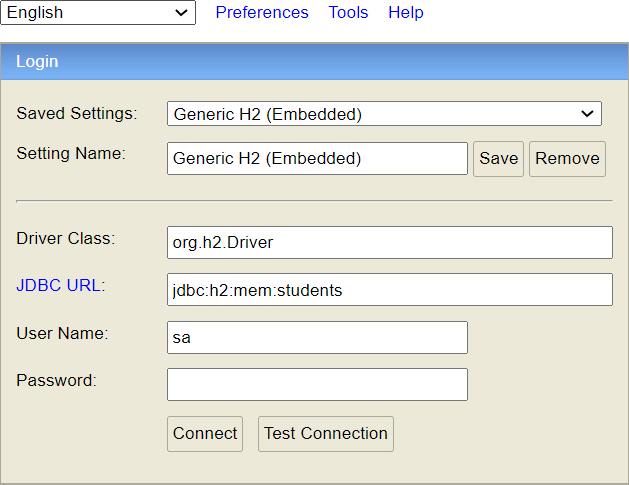
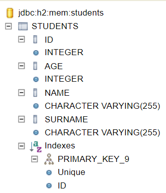
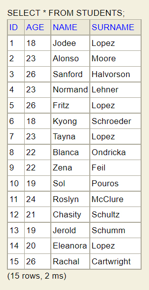
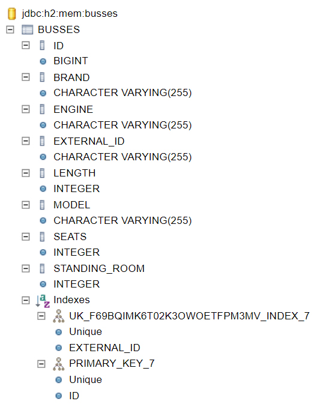
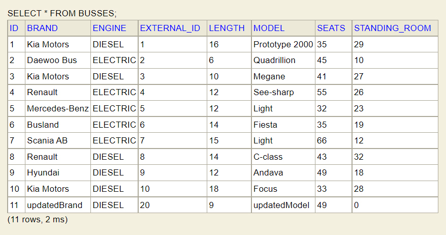

# INTERNSHIP ADB

<p align="justify">
The present repository contains projects that are outcome of my work placement 
(as a part of my first-cycle studies) in <b>ADB POLSKA SP. Z O.O. (ZIELONA GORA OFFICE)</b> 
that took place in <b>July 2021</b>. In the process of work placement I have been introduced to foundations of 
<b>Spring framework</b>. The culmination of work was to implement an example of <b>Representational state transfer 
application programming interface</b> known as a <b>REST API</b>.</p>

<p align="justify">
Note that this is not original repository I was working on during work placement. Projects included here has been 
improved in terms of code quality after reviewing the code. However, the general idea of the projects remained the same. 
Dependencies were updated since the creation of each project, but only up to a certain point.
</p>

<h2 id="list">LIST OF PROJECTS</h2>

- [EX1-BEANS](#ex1)
- [EX2-BEANS](#ex2)
- [EX3-SCHEDULING](#ex3)
- [EX4-STREAM-API-JUNIT-TESTS](#ex4)
- [EX5-EXPERIMENTAL-GET-MAPPING](#ex5)
- [EX6-H2-STUDENTS](#ex6)
- [EX7-RESTAPI-H2-BUSSES](#ex7)

<h2 id="ex1">EX1-BEANS</h2>

<p align="justify">
This project was focused on usage idea of <b>inversion of control (IoC)</b>. There have been defined simple 
<i>Spring Beans</i> of a <i>Spring Component class</i> that were managed by a <i>Spring Container</i> 
implemented as a <b>AnnotationConfigApplicationContext class</b>. The application is also reading and printing out 
specific information from a created <b>properties file</b> during the application compilation. The file looks as follows:
</p>

```properties
#Wed Jul 07 09:31:52 CEST 2021
date=2021-07-07
java-version=11.0.11
program-version=1.0
```

where `date` is computed locally by current date - `LocalDate().now` and `java-version` is **sdk** version.

### Project Details

- Code language: `Java 11`
- Built with: `Maven`
- Properties file: [custom.properties](./internship-adb/EX1-BEANS/src/main/resources/custom.properties)

### Dependencies

[spring-context](https://mvnrepository.com/artifact/org.springframework/spring-context/5.3.23)
(5.3.23)

<p align="right">
<a href="#list">BACK TO PROJECTS LIST</a>
</p>

<h2 id="ex2">EX2-BEANS</h2>

<p align="justify">
This project was focused on using <b>dependency injection</b> in action. It has been shown how to define a 
<i>Spring Bean</i> of a <i>Spring Configuration class</i> with a priority using <code>@Primary</code> 
<b>annotation</b> and also by specifying beans' name attribute. The injection takes place in a method parameter of the 
other bean. The application also proposed an idea of two <b>cooling systems implementations</b>: <i>Fridge class</i> 
and <i>Air Conditioning class</i>.
</p>

### Project Details

- Code language: `Java 11`
- Built with: `Spring Boot` and `Maven`

### Dependencies

[spring-boot-starter](https://mvnrepository.com/artifact/org.springframework.boot/spring-boot-starter/2.7.5)
(2.7.5)

[spring-boot-autoconfigure](https://mvnrepository.com/artifact/org.springframework.boot/spring-boot-autoconfigure/2.7.5)
(2.7.5)

<p align="right">
<a href="#list">BACK TO PROJECTS LIST</a>
</p>

<h2 id="ex3">EX3-SCHEDULING</h2>

<p align="justify">
This project has shown how to <b>schedule</b> a task with <b>Spring</b> using <code>@Scheduled</code> <b>annotation</b>. 
The task was focused on sending <code>GET</code> requests to chosen <i>Web API</i> and process its response.
</p>

- _(Expected)_ RAW response:

```json
[
  {
    "fact": "RANDOM_FACT_HERE"
  }
]
```

- _(Expected)_ Processed response:

```text
RANDOM_FACT_HERE
```

_Random facts are printed on console every **8s**._

### Project Details

- Code language: `Java 11`
- Built with: `Spring Boot` and `Maven`
- [API](https://dukengn.github.io/Dog-facts-API/)

### Dependencies

[spring-boot-starter](https://mvnrepository.com/artifact/org.springframework.boot/spring-boot-starter/2.7.5)
(2.7.5)

[spring-boot-autoconfigure](https://mvnrepository.com/artifact/org.springframework.boot/spring-boot-autoconfigure/2.7.5)
(2.7.5)

<p align="right">
<a href="#list">BACK TO PROJECTS LIST</a>
</p>

<h2 id="ex4">EX4-STREAM-API-JUNIT-TESTS</h2>

<p align="justify">
This project was focused on both usage of <b>stream API</b> and <b>unit testing</b> with <i>JUnit Jupiter</i>. 
The purpose of the project has been satisfied based on an <b>abstract</b> implementation of <i>dogs</i> and <i>cats</i>.
</p>

### Project Details

- Code language: `Java 11`
- Built with: `Maven`
- [Unit tests](./internship-adb/EX4-STREAM-API-JUNIT-TESTS/src/test/java/StreamTest.java)

### Class Hierarchy Tree

- Object (java.lang)
    - Enum (java.lang)
        - Hairiness
        - CatHunterSense
        - DogCommand
    - Animal
        - Cat
        - Dog
    - AnimalUtils
    - AbstractCollection (java.util)
        - AbstractList (java.util)
            - ArrayList (java.util)
                - CustomizedArrayList

### Dependencies

[Lombok](https://projectlombok.org/)
(1.18.24)

[JUnit Jupiter API](https://junit.org/junit5/docs/5.9.0/api/org.junit.jupiter.api/module-summary.html)
(5.9.0)

[JUnit Jupiter Params](https://junit.org/junit5/docs/5.9.0/api/org.junit.jupiter.params/module-summary.html)
(5.9.0)

<p align="right">
<a href="#list">BACK TO PROJECTS LIST</a>
</p>

<h2 id="ex5">EX5-EXPERIMENTAL-GET-MAPPING</h2>

<p align="justify">
This project started as an experiment. It was focused on creating first basic <i>Web API</i>. 
Mapping was only provided for <code>GET</code> method. The concept of the project can be described as:
</p>

- User sends a request with a parameter key `name` and (optionally) defined value.
- _API_ sends a response determined by the provided value of the key.
- If the value of the key is `undefined`, equals to `stranger` or it **DOES NOT MATCH** specified `regex`
  <a href="#ex5regex">&#10549;</a>, _API_ returns general response<a href="#ex5default">&#10549;</a>
  (or error response in some cases).
- Personalized responses' `ids` are **incremented** by **1** and all general responses' `ids` are always **0**.
- Incrementation is stopped being followed once application has been shut down.
- Values of the key are being **formatted** before the _API_ returns a response. Read further for details.
  <a href="#formatting">&#10549;</a>

> The general idea is that user can introduce themselves in a request and then _API_ returns welcome message as a response.

The application **produces** data in `json` format.

### Project Details

- Code language: `Java 11`
- Built with: `Spring Boot` and `Maven`
- Runs `Tomcat` on default port

### API Reference

```text
  GET /meeting
```

```text
  GET /meeting?name=String
```

| Key    | Value    | Description                                     |
|:-------|:---------|:------------------------------------------------|
| `name` | `String` | **Optional**. Your name. `stranger` by default. |  

### RegEx Details

<p id="ex5regex" align="justify"><code>RegEx</code> to match for the key <code>name</code>:</p>

```regexp
^(?!.*[\r\n])[\da-zA-Z ]+$
```

To match this `regex` it is necessary that:

- Provided _String_ **IS NOT BLANK**.
- Provided _String_ contains only **latin** letter(s) in **lower** or **UPPER** case or/and
  number(s) between **0** and **9** or/and space character(s).
- Provided _String_ is single lined.

<h3 id="formatting">About Further Formatting <code>name</code>:</h3>

- Let's say we provide value: `%20L%20u%20%20c%20%20%20as%20%20`
  where `%20` is encoding for a space character.
- Value is being validated. In this case, validation is successful.
- Now it's time for formatting. To simplify how it works, it can be said that:
    - We **split** validated _String_ to multiple strings by each occurred space character.
    - We take each _String_ that **DOES NOT** contain a space character, and we append it to the output.
    - After each, **EXCEPT LAST** appended _String_, we append a singular space character additionally.
    - Formatted output looks like this: <code>L&nbsp;u&nbsp;c&nbsp;as</code>.

> In shortcut, it can be said that every formatted value starts and ends with a latin letter or with a number,
and between any pair (if exists) of the space characters, there is at least one latin letter or a number.

### API Response Examples

<p id="ex5default">General:</p>

```json
{
  "id": 0,
  "message": "Hello stranger. It's nice to meet you."
}
```

Examples:

- `GET /meeting?name=L%20u%20c%20as`

```json
{
  "id": 1,
  "message": "Hello L u c as. It's nice to meet you."
}
```

- `GET /meeting?name=0Lucas3`

```json
{
  "id": 2,
  "message": "Hello 0Lucas3. It's nice to meet you."
}
```

- `GET /meeting?name=10`

```json
{
  "id": 3,
  "message": "Hello 10. It's nice to meet you."
}
```

> Note that it is still possible to force _API_ returning an error response.

### Dependencies

[Lombok](https://projectlombok.org/)
(1.18.24)

[spring-boot-starter-web](https://mvnrepository.com/artifact/org.springframework.boot/spring-boot-starter-web/2.7.5)
(2.7.5)

[spring-boot-autoconfigure](https://mvnrepository.com/artifact/org.springframework.boot/spring-boot-autoconfigure/2.7.5)
(2.7.5)

<p align="right">
<a href="#list">BACK TO PROJECTS LIST</a>
</p>

<h2 id="ex6">EX6-H2-STUDENTS</h2>

<p align="justify">
This project was focused on defining <b>Entity class</b> and <b>Spring Data JPA repositories</b> implementation.
It was built additionally on <b>Spring Component class</b>, <b>Spring Configuration class</b> and 
<b>Spring Service class</b>. <b>Configuration class</b> implements <i>CommandLineRunner interface</i> and 
its method for providing execution of <b>business logic</b> defined in the <i>service class</i>, while the <i>component class</i> 
is responsible for <b>value injection</b> from <i>properties file</i> using <code>@Value</code> <b>annotation</b>. 
The value is used to define a number of students to create and add to the <b>repository</b>. Each student is created randomly 
using some data from <code>Datafaker library</code>. For the presentation needs of <code>findBySurname(String)</code> method, 
it has been guaranteed that for <b>n-students</b>, there are exactly <b>&lfloor;0,3*n&rfloor; students</b> named <i>Lopez</i>. 
Each student <code>id</code> is <b>autogenerated</b> during entity creation. Created entities can be managed from 
<code>H2 DBMS</code>. <i>Properties file</i> for this application looks as follows:
</p>

```properties
instances.number=15

server.port=8080

spring.jpa.open-in-view=false

spring.h2.console.enabled=true
spring.h2.console.path=/h2

spring.datasource.url=jdbc:h2:mem:students
spring.datasource.driverClassName=org.h2.Driver

spring.datasource.username=sa
spring.datasource.password=
```

### Project Details

- Code language: `Java 11`
- Built with: `Spring Boot` and `Maven`
- Runs `Tomcat` on port:`8080`
- Properties file: [application.properties](./internship-adb/EX6-H2-STUDENTS/src/main/resources/application.properties)

### Screenshots








### Dependencies:

[Datafaker](https://www.datafaker.net/documentation/getting-started/)
(1.7.0)

[Lombok](https://projectlombok.org/)
(1.18.24)

[spring-context](https://mvnrepository.com/artifact/org.springframework/spring-context/5.3.23)
(5.3.23)

[spring-boot](https://mvnrepository.com/artifact/org.springframework.boot/spring-boot/2.7.5)
(2.7.5)

[spring-boot-starter-web](https://mvnrepository.com/artifact/org.springframework.boot/spring-boot-starter-web/2.7.5)
(2.7.5)

[spring-boot-starter-data-jpa](https://mvnrepository.com/artifact/org.springframework.boot/spring-boot-starter-data-jpa/2.7.5)
(2.7.5)

[H2 Database Engine](https://mvnrepository.com/artifact/com.h2database/h2/2.1.214)
(2.1.214)

<p align="right">
<a href="#list">BACK TO PROJECTS LIST</a>
</p>

<h2 id="ex7">EX7-RESTAPI-H2-BUSSES</h2>

<p align="justify">
This project was focused on <i>Web API</i> implementation following <b>REST</b> architectural approach.
The project is built from following components:
</p>

- Spring Configuration class
- Spring Rest Controller class
- Spring Service class
- Spring Data JPA repositories
- Spring Rest Controller Adviser class
- Exception classes
- Response Body class
- Model class
- Entity class
- Utility classes

**Utility classes** delivers following functionalities:

- Bus conversion. Mapping **entities** to **model** representation (and vice versa).
- Data generator for busses.
- Validation for _String_ values.
- Shuffling data from _data generator_ to ensure **pseudo-random** results.

**Handled exceptions** using `@ExceptionsHandler` annotation:

- BusNotFound</b> - thrown, if it could not find a bus with given <code>id</code>.
- BusAlreadyExists</b> - thrown, if it could not add a bus with given <code>id</code> (id already taken)
- InvalidDataProvided</b> - thrown, if the required data of the request was invalid. Basically, whenever any of following
  exceptions has been thrown:
    - HttpMessageNotReadableException
    - IllegalArgumentException
    - NullPointerException
    - PropertyValueException

The application **consumes** and **produces** data in `json` format.

### Project Details

- Code language: `Java 11`
- Built with: `Spring Boot` and `Maven`
- Runs `Tomcat` on port:`8080`
- Properties file: [application.properties](./internship-adb/EX7-RESTAPI-H2-BUSSES/src/main/resources/application.properties)

### API Reference

**1. GET**

```text
  GET /busses
```

```text
  GET /busses?engine=String
```

| Key       | Value    | Description                       |
|:----------|:---------|:----------------------------------|
| `engine`  | `String` | **Optional**. Type of bus engine. |

```text
  GET /busses/{id}
```

where `id` is a value of a non-negative integer.

<br>

**2. POST**

```text
  POST /busses
```

- Valid **request body** pattern:

```text
{
  "id": int,
  "brand": String,
  "model": int || String,
  "seats": int || null,
  "standingRoom": int || null,
  "length": int || null,
  "engine": String
}
```

- where `int` is a non-negative integer.
- `null` values are converted to **0s**.
- each `int` can be expressed as a `String` as well.

<br>

**3. PUT**

```text
  PUT /busses/{id}
```

where `id` is a value of a non-negative integer.

- Valid **request body** pattern:

```text
{
  "id": int,
  "brand": String,
  "model": int || String,
  "seats": int || null,
  "standingRoom": int || null,
  "length": int || null,
  "engine": String
}
```

- where `int` is a non-negative integer.
- `null` values are converted to **0s**.
- each `int` can be expressed as a `String` as well.

<br>

**4. DELETE**

```text
  DELETE /busses/{id}
```

where `id` is a value of a non-negative integer.

<br>

### RegEx Details

<p id="ex7num-regex"><code>RegEx</code> to match for <code>id</code>, <code>seats</code>, <code>standingRoom</code> 
and <code>length</code>:</p>

```regexp
^\d+$
```

Just a number or sequence of numbers between **0** and **9**.

<br>

<p id="ex7brand-regex"><code>RegEx</code> to match for <code>brand</code>:</p>

```regexp
^(?!.*[_\r\n])[a-zA-Z]([-a-zA-Z ]*[a-zA-Z])?$
```

To match this `regex` it is necessary that:

- Provided _String_ **IS NOT BLANK**.
- Provided _String_ starts and ends with any **latin** letter in **lower**< or **UPPER** case.
- Provided _String_ is single lined.
- Every except **FIRST** and **LAST** index of provided _String_ can be:
    - A **latin** letter in **lower** or **UPPER** case.
    - A space character.
    - A dash: <code>&#8212;</code>.

<br>

<p id="ex7model-regex"><code>RegEx</code> to match for <code>model</code>:</p>

```regexp
^(?!.*[_\r\n])\w([-\w ]*\w)?$
```

To match this `regex` it is necessary that:

- Provided _String_ **IS NOT BLANK**.
- Provided _String_ starts and ends with a **latin** letter in **lower** or **UPPER** case or with any number between
  **0** and **9**.
- Provided _String_ is single lined.
- Every except **FIRST** and **LAST** index of provided _String_ can be:
    - A **latin** letter in **lower** or **UPPER** case.
    - Any number between **0** and **9**.
    - A space character.
    - A dash: <code>&#8212;</code>.

<br>

<p id="ex7engine-regex"><code>RegEx</code> to match for <code>engine</code>:</p>

```regexp
^((?i)\bdiesel\b+?|(?i)\belectric\b+?)*$
```

<p align="justify">
To match this <code>regex</code> it is necessary to provide either <code>diesel</code> or <code>electric</code> in 
<b>CASE-INSENSITIVE</b> variant and in a <b>SINGLE OCCURRENCE</b>. That means each letter of either word can be independently 
in <b>UPPER</b> or <b>lower</b> case.
</p>

### API Response Examples

<p align="center"><b>Let's consider valid requests at first.</b></p>

- [x] `GET /busses`


- HTTP status: **_200 OK_**
- Response:

```json5
[
  {
    "id": "1",
    "brand": "Kia Motors",
    "model": "Prototype 2000",
    "seats": 35,
    "standingRoom": 29,
    "length": 16,
    "engine": "DIESEL"
  },
  {
    "id": "2",
    "brand": "Daewoo Bus",
    "model": "Quadrillion",
    "seats": 45,
    "standingRoom": 10,
    "length": 6,
    "engine": "ELECTRIC"
  },
  .,
  .,
  .,
  {
    "id": "10",
    "brand": "Kia Motors",
    "model": "Focus",
    "seats": 33,
    "standingRoom": 28,
    "length": 18,
    "engine": "DIESEL"
  }
]
```

<br>

- [x] `GET /busses?engine=ELECTRIC`


- HTTP status: **_200 OK_**
- Response:

```json5
[
  {
    "id": "2",
    "brand": "Daewoo Bus",
    "model": "Quadrillion",
    "seats": 45,
    "standingRoom": 10,
    "length": 6,
    "engine": "ELECTRIC"
  },
  {
    "id": "4",
    "brand": "Renault",
    "model": "See-sharp",
    "seats": 55,
    "standingRoom": 26,
    "length": 12,
    "engine": "ELECTRIC"
  },
  .,
  .,
  .,
  {
    "id": "7",
    "brand": "Scania AB",
    "model": "Light",
    "seats": 66,
    "standingRoom": 12,
    "length": 15,
    "engine": "ELECTRIC"
  }
]
```

<br>

- [x] `GET /busses/3`


- HTTP status: **_200 OK_**
- Response:

```json
{
  "id": "3",
  "brand": "Kia Motors",
  "model": "Megane",
  "seats": 41,
  "standingRoom": 27,
  "length": 10,
  "engine": "DIESEL"
}
```

<br>

- [x] `POST /busses`

Request body:

```json
{
  "id": 20,
  "brand": "myBrand",
  "model": "myModel",
  "seats": 50,
  "standingRoom": 14,
  "length": 8,
  "engine": "eLeCtRiC"
}
```

- Http status: **_201 Created_**
- Response:

```json
{
  "id": "20",
  "brand": "myBrand",
  "model": "myModel",
  "seats": 50,
  "standingRoom": 14,
  "length": 8,
  "engine": "ELECTRIC"
}
```

<br>

- [x] `PUT /busses/20`

Request body:

```json
{
  "id": "21",
  "brand": "updatedBrand",
  "model": "updatedModel",
  "seats": 49,
  "standingRoom": 0,
  "length": 9,
  "engine": "diesel"
}
```

- Http status: **_200 OK_**
- Response:

```json
{
  "id": "20",
  "brand": "updatedBrand",
  "model": "updatedModel",
  "seats": 49,
  "standingRoom": 0,
  "length": 9,
  "engine": "DIESEL"
}
```

As we can see, once value is assigned to `id`, the property became <b>immutable</b>.

<br>

- [x] `DELETE /busses/20`


- Http status: **_204 No content_**
- Response:

```text

```

The _response_ is `void`.

<hr>
<p align="center"><b>Now we are going to consider what happens if we do something wrong.</b></p>

- [ ] `GET /busses/engine=myEngine`


- `myEngine` **DOES NOT MATCH** declared `regex`<a href="#ex7engine-regex">&#10548;</a>
- HTTP status: **_400 Bad Request_**
- Response:

```json
{
  "code": 3,
  "message": "Something went wrong. Validate provided data."
}
```

<br>

- [ ] `GET /busses/{id}`
- [ ] `PUT /busses/{id}`
- [ ] `DELETE /busses/{id}`

Path variable: `myId`

- `myId` **DOES NOT MATCH** declared `regex`<a href="#ex7num-regex">&#10548;</a>, hence repository does not contain a bus
  with such id.
- HTTP status: **_404 Not Found_**
- Response:

```json
{
  "code": 1,
  "message": "Bus with id: [myId] not found."
}
```

Path variable: `0`

- We assume repository **DOES NOT CONTAIN** a bus with id: `0`
- HTTP status: **_404 Not Found_**
- Response:

```json
{
  "code": 1,
  "message": "Bus with id: [0] not found."
}
```

<br>

- [ ] `POST /busses`

Request body:

```json
{
  "id": "20",
  "brand": "newBrand",
  "model": "newModel",
  "seats": 25,
  "standingRoom": 10,
  "length": 4,
  "engine": "DIESEL"
}
```

- HTTP status: **_409 Conflict_**
- Response:

```json
{
  "code": 2,
  "message": "Bus with id: [20] already exists."
}
```

since we recently added a bus with `id=20`.

<br>

Request body:

```json
{
  "id": "a",
  "brand": "newBrand",
  "model": "newModel",
  "seats": 25,
  "standingRoom": 10,
  "length": 4,
  "engine": "DIESEL"
}
```

- HTTP status: **_400 Bad Request_**
- Response:

```json
{
  "code": 3,
  "message": "Something went wrong. Validate provided data."
}
```

since `a` **DOES NOT MATCH** declared `regex`.<a href="#ex7num-regex">&#10548;</a>

<br>

_Now we assume that bus with `id=40` does not exist yet._

Request body:

```json
{
  "id": "40",
  "brand": "?",
  "model": "!",
  "seats": 25,
  "standingRoom": 10,
  "length": 4,
  "engine": "DIESEL"
}
```

- HTTP status: **_400 Bad Request_**
- Response:

```json
{
  "code": 3,
  "message": "Something went wrong. Validate provided data."
}
```

since `?` and `!` **DOES NOT MATCH** declared `regex`.<a href="#ex7brand-regex">&#10548;</a>

<br>

Request body:

```json
{
  "id": "40",
  "brand": "newBrand",
  "model": "newModel",
  "seats": "b",
  "standingRoom": "c",
  "length": "d",
  "engine": "DIESEL"
}
```

- HTTP status: **_400 Bad Request_**
- Response:

```json
{
  "code": 3,
  "message": "Something went wrong. Validate provided data."
}
```

since `b` and `c` and `d` **DOES NOT MATCH** declared `regex`.<a href="#ex7num-regex">&#10548;</a>

<br>

Request body:

```json
{
  "id": "40",
  "brand": "newBrand",
  "model": "newModel",
  "seats": 25,
  "standingRoom": 10,
  "length": 4,
  "engine": true
}
```

- HTTP status: **_400 Bad Request_**
- Response:

```json
{
  "code": 3,
  "message": "Something went wrong. Validate provided data."
}
```

since `String` value of `true` **DOES NOT MATCH** declared `regex`.<a href="#ex7engine-regex">&#10548;</a>

<br>

Request body:

```json
{
  "brand": "newBrand",
  "model": "newModel",
  "seats": 25,
  "standingRoom": 10,
  "length": 4,
  "engine": "DIESEL"
}
```

- HTTP status: **_400 Bad Request_**
- Response:

```json
{
  "code": 3,
  "message": "Something went wrong. Validate provided data."
}
```

since there is no occurrence of required `json property`. In this case it is no occurrence of `id`.

### Screenshots






### Dependencies

[Lombok](https://projectlombok.org/)
(1.18.24)

[spring-boot-starter-web](https://mvnrepository.com/artifact/org.springframework.boot/spring-boot-starter-web/2.7.5)
(2.7.5)

[spring-boot-starter-data-jpa](https://mvnrepository.com/artifact/org.springframework.boot/spring-boot-starter-data-jpa/2.7.5)
(2.7.5)

[H2 Database Engine](https://mvnrepository.com/artifact/com.h2database/h2/2.1.214)
(2.1.214)

[Hibernate Core](https://mvnrepository.com/artifact/org.hibernate/hibernate-core/5.6.12.Final)
(5.6.12.Final)

<p align="right">
<a href="#list">BACK TO PROJECTS LIST</a>
</p>

## Author

[@lucasmalara](https://github.com/lucasmalara "author")